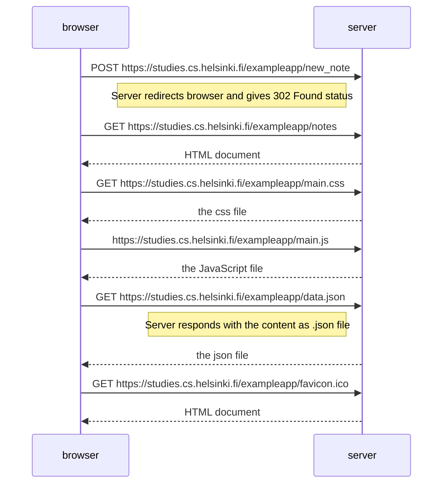

```mermaid
sequenceDiagram
    participant browser
    participant server
    browser->>server: POST https://studies.cs.helsinki.fi/exampleapp/new_note
    Note left of server: Server redirects browser and gives 302 Found status
    browser->>server: GET https://studies.cs.helsinki.fi/exampleapp/notes
    server-->>browser: HTML document
    browser->>server: GET https://studies.cs.helsinki.fi/exampleapp/main.css
    server-->>browser: the css file
    browser->>server: https://studies.cs.helsinki.fi/exampleapp/main.js
    server-->>browser: the JavaScript file
    browser->>server: GET https://studies.cs.helsinki.fi/exampleapp/data.json
    Note left of server: Server responds with the content as .json file
    server-->>browser: the json file
    browser->>server: GET https://studies.cs.helsinki.fi/exampleapp/favicon.ico
    server-->>browser: HTML document
```
